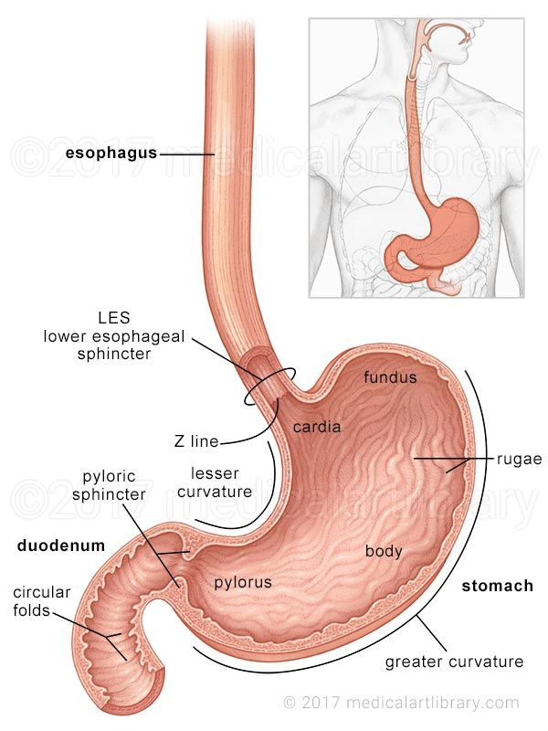
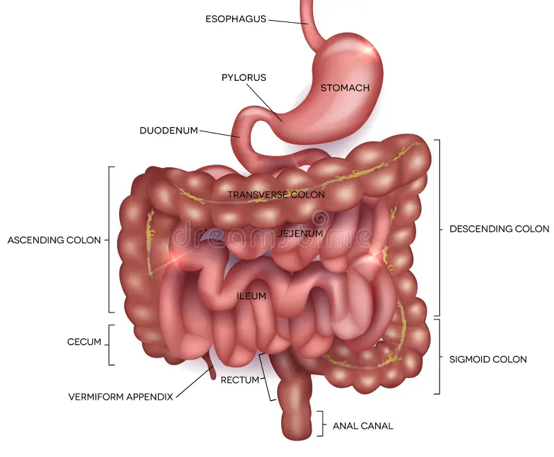

# Exploring Datasets
- Has many information : https://datasets.simula.no/kvasir/
## Core benchmark datasets
- Kvasir-SEG : https://www.kaggle.com/datasets/debeshjha1/kvasirseg
- CVC-ClinicDB : https://www.kaggle.com/datasets/balraj98/cvcclinicdb
- ETIS-LaribPolypDB : https://www.kaggle.com/datasets/nguyenvoquocduong/etis-laribpolypdb
## Advanced / newer datasets
- Hyper-Kvasir : https://www.kaggle.com/datasets/kelkalot/the-hyper-kvasir-dataset
- Kvasir Capsule : https://www.kaggle.com/datasets/debeshjha1/kvasircapsuleseg

# Reading : 
**Gastroscopy** is an examination of the upper GI tract including esophagus, stomach and first part of small bowel  
**Colonoscopy** covers the large bowel (colon) and rectum.  
**Adenoma** detection is therefore considered to be an important quality indicator in colorectal cancer screening  
**Endoscopic** assessment of severity and sub-classification of different findings may also vary from one doctor to another  

## Categorical tree
```bash
Endoscopy Findings
├── Normal Anatomy
│   ├── Z-line
│   │     # Recognition and assessment of the Z-line is important in order to determine whether disease is present or not. 
│   │     # For example, this is the area where signs of gastro-esophageal reflux may appear. 
│   ├── Pylorus
│   │     # Complete gastroscopy includes inspection on both sides of the pyloric opening to reveal findings like 
│   │     # ulcerations, erosions or stenosis
│   └── Cecum
```


```bash
├── Abnormal Findings (Lesions/Pathology)
│   ├── Polyp
│   │    ├ Hyperplastic
│   │    ├ Adenoma
│   │    └ Serrated
│   │
│   ├── Ulcer
│   ├── Inflammation
│   │    ├ Esophagitis
│   │    └ Ulcerative colitis
│   │
│   └── Tumor/Cancer
│
└── Therapeutic / Procedural States
     ├ Dyed lifted polyp
     ├ Resection margins
     └ Instrument scenes
```

## Goals
1. GI Scene Recognition
2. Lesion Detection / Localization
3. Lesion Delineation (Segmentation)
4. Clinical Interpretation / Decision Support
5. Procedural Reporting / Real-time Assistance

# Analysing Dataset
## Spark
- Download dataset kvasir-dataset-v2.zip from https://datasets.simula.no/downloads/kvasir/kvasir-dataset-v2.zip and extract in data/raw/ folder 
- Must even dowload java ()
```bash
# https://documentation.ubuntu.com/ubuntu-for-developers/howto/java-setup/?_gl=1*emzps5*_gcl_au*NDgyMjA0ODg3LjE3NzcxMzMxMzg.#install-java
sudo apt install openjdk-21-jdk
java -version
# openjdk version "21.0.10" 2026-01-20
# OpenJDK Runtime Environment (build 21.0.10+7-Ubuntu-124.04)
# OpenJDK 64-Bit Server VM (build 21.0.10+7-Ubuntu-124.04, mixed mode, sharing)
```
- https://medium.com/@nomannayeem/pyspark-made-simple-from-basics-to-big-data-mastery-cb1d702968be  
- https://www.datacamp.com/tutorial/pyspark-tutorial-getting-started-with-pyspark  